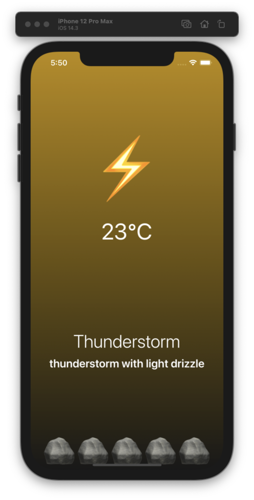

# 🌤 react-native-weather-app
- A simple weather app using [OpenWeatherMap API](https://openweathermap.org/api)
- Learning React Native with NomadCoders.
    - [`Beginners` React Native Fundamentals](https://nomadcoders.co/react-native-fundamentals)

<div>
    
    
    
</div>
<div>
    
    
    
</div>

## 🤹‍♀️ Getting Started

### Requirement
- [Node.js](https://nodejs.org/en/)
- [Yarn](https://classic.yarnpkg.com/en/)
- [React native](https://reactnative.dev/docs/getting-started)
- [Expo CLI](https://expo.io/tools)
- [Xcode](https://developer.apple.com/xcode/) for iOS development

### Clone
```
git clone https://github.com/yj-oh/react-native-weather-app.git
```
### Install dependencies
```
cd react-native-weather-app
yarn install
```
### ⭐️ Setting up API Key
- To run project you need to provide your own OpenWeatherMap API Key.
- Go to https://openweathermap.org/api, sign up and get an API key.
- Create a `env.json` file in the root directory.
```json
{
  "api_key": "YOUR_API_KEY_HERE"
}
```
### Run the app with Expo
```
yarn start
```
- You'll then be in the expo development environment.
- You can either :
    - Open the iOS Simulator.
    - Open it in the Expo app on your phone.

## 🔮 Dependencies
dependency | version
--- | ---
react | 16.13.1
expo | ~40.0.0
expo-location | ~10.0.0
expo-linear-gradient | ^8.4.0
axios | ^0.21.0
prettier | ^2.2.1
